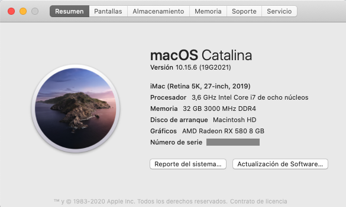
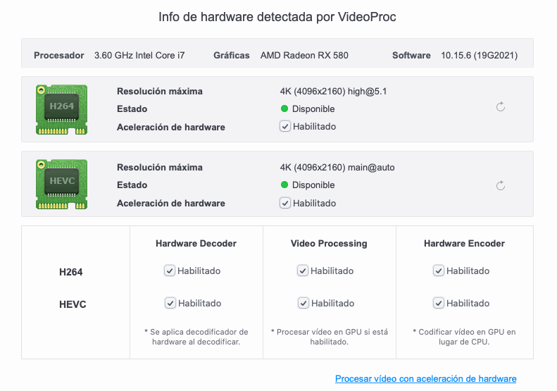

# Hackintosh

## Hardhare
  
|   |  Description |
| ------------ | ------------ |
| MOBO | Gigabyte Z390 gaming X  |
| CPU |  I7-9700K |
| GPU  |   RX580/UHD 630  |
| RAM  |  16GB 3000MHz DDR4 X 2 |
| WIFI | BCM94360 |

##

## OS Ver.
macOS Catalina 10.15.6

## BIOS
- F10G
